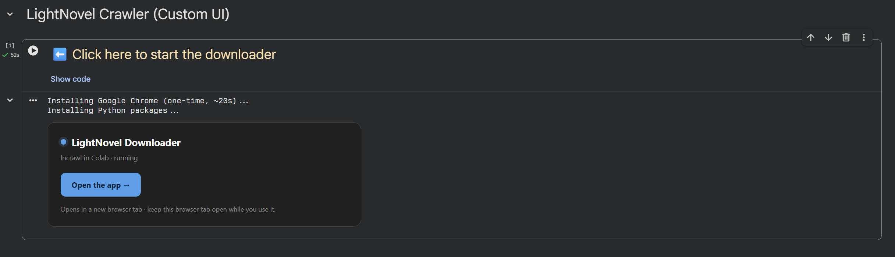
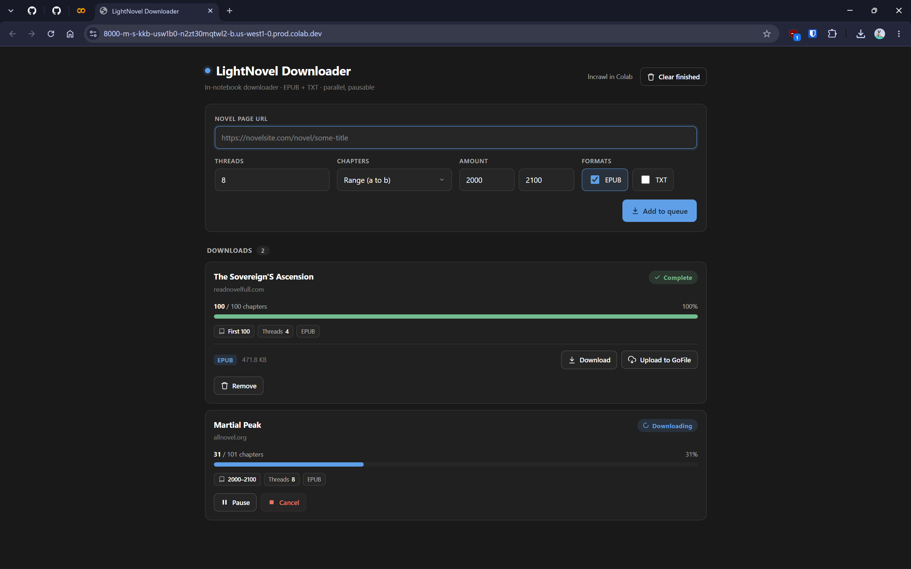

# LightNovel Crawler for Colab

A custom interface for [lightnovel-crawler](https://github.com/dipu-bd/lightnovel-crawler) that runs in Google Colab. It gives you a real web app instead of a cramped notebook cell, so you can download multiple novels at once, control threads, pause and resume, pick chapter ranges, and either download the files directly or upload them to GoFile.

## Open in Colab

## Features

- Download several novels at the same time.
- Set the number of threads per download, or leave it on the source default.
- Pause and resume a download without losing progress.
- Download all chapters, the first N, the last N, or a specific range (a to b).
- Export to EPUB and TXT.
- Download each file straight to your device, or upload it to GoFile and get a share link.
- Clean web interface that opens in its own browser tab.

## How to use

1. Open the notebook in Colab with the button above.
2. Run the first cell. The first run installs Chrome and the Python packages, which takes about a minute.
3. When it finishes, click **Open the app** to open the downloader in a new tab.
4. Paste a novel URL, choose your options, and add it to the queue.

Keep the Colab cell running while you use the app. If you close it, the server stops.

## Screenshots

The launcher cell:

The downloader:

## Legacy server

The original setup used the built-in lightnovel-crawler web server. It is kept as a fallback for anyone who prefers it or runs into trouble with the new app. You can still launch it from the notebook if needed.

## Notes

- Downloading multiple novels at once works best when each comes from a different website. Novels from the same site share its rate limit, so running them together gives no speed benefit and can get the Colab IP banned.
- Thread control is unreliable. Many sources rate limit or override the value, and pushing it high tends to cause failed chapters or bans. Leave it on the source default, and only raise it to a low value (8 at most) if you really need to. The default depends on the source (lightnovel-crawler uses 5 as its base, and some sources set it lower).
- A source being listed as working does not mean it has the novel you want, or that the novel is complete on that source. Always check the chapter count while downloading.

## Credits

- [dipu-bd/lightnovel-crawler](https://github.com/dipu-bd/lightnovel-crawler) for the crawler this project is built on.
- [m0bb1n/gofilepy](https://github.com/m0bb1n/gofilepy) for the GoFile API wrapper.
